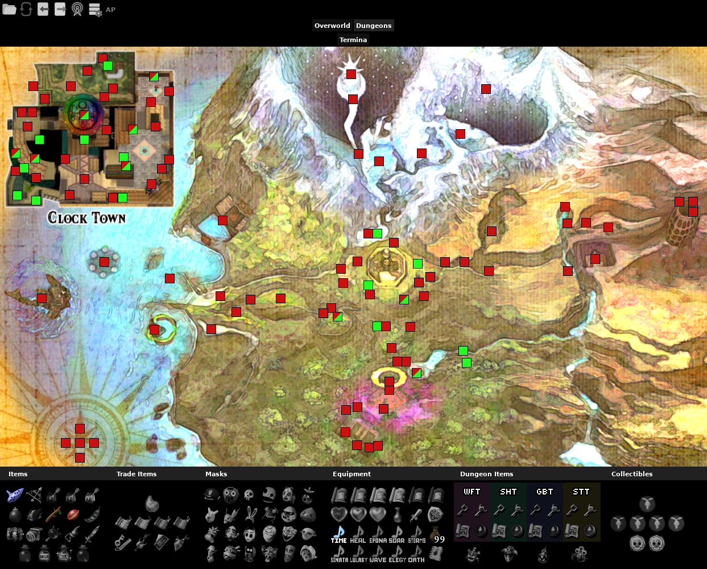

Archipelago Majora’s Mask Recompiled tracker pack for [PopTracker](https://github.com/black-sliver/PopTracker/) with auto-tracking, made by Seto and G4M3R L1F3.

PopTracker v0.32.0 is the earliest version that will work.

## Installation

[Download the latest build or source](https://github.com/G4M3RL1F3/Majoras-Mask-AP-PopTracker-Pack/releases/latest) and move the file into your packs folder. Alternatively, you can drag it on top of a PopTracker window, which will prompt you if you want to install the pack.

## Autotracking

Currently, the only autotracking method is by connecting to a slot in a Archipelago server. Therefore, it is not yet possible to autotrack in singleplayer (as in generated within Recomp). Follow these steps to connect to a server and autotrack your game:
1. Click the grey `AP` button in the top left of the window; A new window will open.
2. In the new window, type the server's host (`archipelago.gg` or `localhost`), followed by `:`, then the port (represented by five numbers and are unique to the session). Click `OK`.
3. Enter the slot name. In other words, the name that was written in the yaml used to generate. Click `OK`.
4. If applicable, enter the password. Click `OK`.

If entered correctly, the `AP` button will turn green, meaning it is connected to the server and is autotracking. If it remains red, make sure the server is opened.

## More Info

This pack is a work in progress and is developed as the logic and features are being worked on. It follows Archipelago’s logic, not necessarily matching standalone or higher difficulties at this time. A logic issue from the apworld will be mirrored in the tracker for the sake of catching issues. The logic in the tracker will only be updated once the apworld's will be.

If you encounter any bugs or have any questions, feel free to ask by pinging in Discord the maintainer (@g4m3rl1f3).